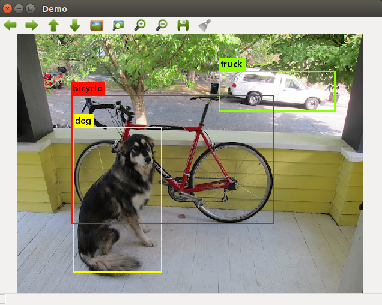
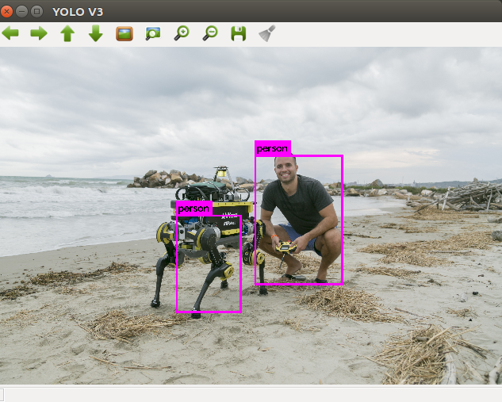

<<<<<<< HEAD
# YOLO ROS: Real-Time Object Detection for ROS

## Updates made by Marcelino Almeida:
-- Fixed issue that this node would publish garbage into ROS when using with a TX1 or TX2.

-- Added semaphores to avoid processing the same image twice (the original version of this branch would be extensively using CPU/GPU reprocessing repeated images that were at a low frequency).

## Overview

This is a ROS package developed for object detection in camera images. You only look once (YOLO) is a state-of-the-art, real-time object detection system. In the following ROS package you are able to use YOLO (V3) on GPU and CPU. The pre-trained model of the convolutional neural network is able to detect pre-trained classes including the data set from VOC and COCO, or you can also create a network with your own detection objects. For more information about YOLO, Darknet, available training data and training YOLO see the following link: [YOLO: Real-Time Object Detection](http://pjreddie.com/darknet/yolo/).

The YOLO packages have been tested under ROS Melodic and Ubuntu 18.04. This is research code, expect that it changes often and any fitness for a particular purpose is disclaimed.

**Author: [Marko Bjelonic](http://www.markobjelonic.me), marko.bjelonic@mavt.ethz.ch**

**Affiliation: [Robotic Systems Lab](http://www.rsl.ethz.ch/), ETH Zurich**




Based on the [Pascal VOC](https://pjreddie.com/projects/pascal-voc-dataset-mirror/) 2012 dataset, YOLO can detect the 20 Pascal object classes:

- person
- bird, cat, cow, dog, horse, sheep
- aeroplane, bicycle, boat, bus, car, motorbike, train
- bottle, chair, dining table, potted plant, sofa, tv/monitor

Based on the [COCO](http://cocodataset.org/#home) dataset, YOLO can detect the 80 COCO object classes:

- person
- bicycle, car, motorbike, aeroplane, bus, train, truck, boat
- traffic light, fire hydrant, stop sign, parking meter, bench
- cat, dog, horse, sheep, cow, elephant, bear, zebra, giraffe
- backpack, umbrella, handbag, tie, suitcase, frisbee, skis, snowboard, sports ball, kite, baseball bat, baseball glove, skateboard, surfboard, tennis racket
- bottle, wine glass, cup, fork, knife, spoon, bowl
- banana, apple, sandwich, orange, broccoli, carrot, hot dog, pizza, donut, cake
- chair, sofa, pottedplant, bed, diningtable, toilet, tvmonitor, laptop, mouse, remote, keyboard, cell phone, microwave, oven, toaster, sink, refrigerator, book, clock, vase, scissors, teddy bear, hair drier, toothbrush

## Citing

The YOLO methods used in this software are described in the paper: [You Only Look Once: Unified, Real-Time Object Detection](https://arxiv.org/abs/1506.02640).

If you are using YOLO V3 for ROS, please add the following citation to your publication:

M. Bjelonic
**"YOLO ROS: Real-Time Object Detection for ROS"**,
URL: https://github.com/leggedrobotics/darknet_ros, 2018.

    @misc{bjelonicYolo2018,
      author = {Marko Bjelonic},
      title = {{YOLO ROS}: Real-Time Object Detection for {ROS}},
      howpublished = {\url{https://github.com/leggedrobotics/darknet_ros}},
      year = {2016--2018},
    }

## Installation

### Dependencies

This software is built on the Robotic Operating System ([ROS]), which needs to be [installed](http://wiki.ros.org) first. Additionally, YOLO for ROS depends on following software:

- [OpenCV](http://opencv.org/) (computer vision library),
- [boost](http://www.boost.org/) (c++ library),

### Building

[](https://ci.leggedrobotics.com/job/github_leggedrobotics/job/darknet_ros/job/master/)

In order to install darknet_ros, clone the latest version using SSH (see [how to set up an SSH key](https://confluence.atlassian.com/bitbucket/set-up-an-ssh-key-728138079.html)) from this repository into your catkin workspace and compile the package using ROS.

    cd catkin_workspace/src
    git clone --recursive https://github.com/AkellaSummerResearch/darknet_ros.git
    cd ../

To maximize performance, make sure to build in *Release* mode. You can specify the build type by setting

    catkin_make -DCMAKE_BUILD_TYPE=Release

or using the [Catkin Command Line Tools](http://catkin-tools.readthedocs.io/en/latest/index.html#)

    catkin build darknet_ros -DCMAKE_BUILD_TYPE=Release

Darknet on the CPU is fast (approximately 1.5 seconds on an Intel Core i7-6700HQ CPU @ 2.60GHz × 8) but it's like 500 times faster on GPU! You'll have to have an Nvidia GPU and you'll have to install CUDA. The CMakeLists.txt file automatically detects if you have CUDA installed or not. CUDA is a parallel computing platform and application programming interface (API) model created by Nvidia. If you do not have CUDA on your System the build process will switch to the CPU version of YOLO. If you are compiling with CUDA, you might receive the following build error:

    nvcc fatal : Unsupported gpu architecture 'compute_61'.

This means that you need to check the compute capability (version) of your GPU. You can find a list of supported GPUs in CUDA here: [CUDA - WIKIPEDIA](https://en.wikipedia.org/wiki/CUDA#Supported_GPUs). Simply find the compute capability of your GPU and add it into darknet_ros/CMakeLists.txt. Simply add a similar line like

    -O3 -gencode arch=compute_62,code=sm_62

### Download weights

The yolo-voc.weights and tiny-yolo-voc.weights are downloaded automatically in the CMakeLists.txt file. If you need to download them again, go into the weights folder and download the two pre-trained weights from the COCO data set:

    cd catkin_workspace/src/darknet_ros/darknet_ros/yolo_network_config/weights/
    wget http://pjreddie.com/media/files/yolov2.weights
    wget http://pjreddie.com/media/files/yolov2-tiny.weights

And weights from the VOC data set can be found here:

    wget http://pjreddie.com/media/files/yolov2-voc.weights
    wget http://pjreddie.com/media/files/yolov2-tiny-voc.weights

And the pre-trained weight from YOLO v3 can be found here:

    wget http://pjreddie.com/media/files/yolov3-voc.weights
    wget http://pjreddie.com/media/files/yolov3.weights

### Use your own detection objects

In order to use your own detection objects you need to provide your weights and your cfg file inside the directories:

    catkin_workspace/src/darknet_ros/darknet_ros/yolo_network_config/weights/
    catkin_workspace/src/darknet_ros/darknet_ros/yolo_network_config/cfg/

In addition, you need to create your config file for ROS where you define the names of the detection objects. You need to include it inside:

    catkin_workspace/src/darknet_ros/darknet_ros/config/

Then in the launch file you have to point to your new config file in the line:

    <rosparam command="load" ns="darknet_ros" file="$(find darknet_ros)/config/your_config_file.yaml"/>

### Unit Tests

Run the unit tests using the [Catkin Command Line Tools](http://catkin-tools.readthedocs.io/en/latest/index.html#)

    catkin build darknet_ros --no-deps --verbose --catkin-make-args run_tests

You will see the image above popping up.

## Basic Usage

In order to get YOLO ROS: Real-Time Object Detection for ROS to run with your robot, you will need to adapt a few parameters. It is the easiest if duplicate and adapt all the parameter files that you need to change from the `darkned_ros` package. These are specifically the parameter files in `config` and the launch file from the `launch` folder.

## Nodes

### Node: darknet_ros

This is the main YOLO ROS: Real-Time Object Detection for ROS node. It uses the camera measurements to detect pre-learned objects in the frames.

### ROS related parameters

You can change the names and other parameters of the publishers, subscribers and actions inside `darkned_ros/config/ros.yaml`.

#### Subscribed Topics

* **`/camera_reading`** ([sensor_msgs/Image])

    The camera measurements.

#### Published Topics

* **`object_detector`** ([std_msgs::Int8])

    Publishes the number of detected objects.

* **`bounding_boxes`** ([darknet_ros_msgs::BoundingBoxes])

    Publishes an array of bounding boxes that gives information of the position and size of the bounding box in pixel coordinates.

* **`detection_image`** ([sensor_msgs::Image])

    Publishes an image of the detection image including the bounding boxes.

#### Actions

* **`camera_reading`** ([sensor_msgs::Image])

    Sends an action with an image and the result is an array of bounding boxes.

### Detection related parameters

You can change the parameters that are related to the detection by adding a new config file that looks similar to `darkned_ros/config/yolo.yaml`.

* **`image_view/enable_opencv`** (bool)

    Enable or disable the open cv view of the detection image including the bounding boxes.

* **`image_view/wait_key_delay`** (int)

    Wait key delay in ms of the open cv window.

* **`yolo_model/config_file/name`** (string)

    Name of the cfg file of the network that is used for detection. The code searches for this name inside `darkned_ros/yolo_network_config/cfg/`.

* **`yolo_model/weight_file/name`** (string)

    Name of the weights file of the network that is used for detection. The code searches for this name inside `darkned_ros/yolo_network_config/weights/`.

* **`yolo_model/threshold/value`** (float)

    Threshold of the detection algorithm. It is defined between 0 and 1.

* **`yolo_model/detection_classes/names`** (array of strings)

    Detection names of the network used by the cfg and weights file inside `darkned_ros/yolo_network_config/`.
=======
# darknet


## Getting started

To make it easy for you to get started with GitLab, here's a list of recommended next steps.

Already a pro? Just edit this README.md and make it your own. Want to make it easy? [Use the template at the bottom](#editing-this-readme)!

## Add your files

- [ ] [Create](https://docs.gitlab.com/ee/user/project/repository/web_editor.html#create-a-file) or [upload](https://docs.gitlab.com/ee/user/project/repository/web_editor.html#upload-a-file) files
- [ ] [Add files using the command line](https://docs.gitlab.com/ee/gitlab-basics/add-file.html#add-a-file-using-the-command-line) or push an existing Git repository with the following command:

```
cd existing_repo
git remote add origin https://gitlab.cds.tohoku.ac.jp/horippy/darknet.git
git branch -M main
git push -uf origin main
```

## Integrate with your tools

- [ ] [Set up project integrations](https://gitlab.cds.tohoku.ac.jp/horippy/darknet/-/settings/integrations)

## Collaborate with your team

- [ ] [Invite team members and collaborators](https://docs.gitlab.com/ee/user/project/members/)
- [ ] [Create a new merge request](https://docs.gitlab.com/ee/user/project/merge_requests/creating_merge_requests.html)
- [ ] [Automatically close issues from merge requests](https://docs.gitlab.com/ee/user/project/issues/managing_issues.html#closing-issues-automatically)
- [ ] [Enable merge request approvals](https://docs.gitlab.com/ee/user/project/merge_requests/approvals/)
- [ ] [Automatically merge when pipeline succeeds](https://docs.gitlab.com/ee/user/project/merge_requests/merge_when_pipeline_succeeds.html)

## Test and Deploy

Use the built-in continuous integration in GitLab.

- [ ] [Get started with GitLab CI/CD](https://docs.gitlab.com/ee/ci/quick_start/index.html)
- [ ] [Analyze your code for known vulnerabilities with Static Application Security Testing(SAST)](https://docs.gitlab.com/ee/user/application_security/sast/)
- [ ] [Deploy to Kubernetes, Amazon EC2, or Amazon ECS using Auto Deploy](https://docs.gitlab.com/ee/topics/autodevops/requirements.html)
- [ ] [Use pull-based deployments for improved Kubernetes management](https://docs.gitlab.com/ee/user/clusters/agent/)
- [ ] [Set up protected environments](https://docs.gitlab.com/ee/ci/environments/protected_environments.html)

***

# Editing this README

When you're ready to make this README your own, just edit this file and use the handy template below (or feel free to structure it however you want - this is just a starting point!). Thank you to [makeareadme.com](https://www.makeareadme.com/) for this template.

## Suggestions for a good README
Every project is different, so consider which of these sections apply to yours. The sections used in the template are suggestions for most open source projects. Also keep in mind that while a README can be too long and detailed, too long is better than too short. If you think your README is too long, consider utilizing another form of documentation rather than cutting out information.

## Name
Choose a self-explaining name for your project.

## Description
Let people know what your project can do specifically. Provide context and add a link to any reference visitors might be unfamiliar with. A list of Features or a Background subsection can also be added here. If there are alternatives to your project, this is a good place to list differentiating factors.

## Badges
On some READMEs, you may see small images that convey metadata, such as whether or not all the tests are passing for the project. You can use Shields to add some to your README. Many services also have instructions for adding a badge.

## Visuals
Depending on what you are making, it can be a good idea to include screenshots or even a video (you'll frequently see GIFs rather than actual videos). Tools like ttygif can help, but check out Asciinema for a more sophisticated method.

## Installation
Within a particular ecosystem, there may be a common way of installing things, such as using Yarn, NuGet, or Homebrew. However, consider the possibility that whoever is reading your README is a novice and would like more guidance. Listing specific steps helps remove ambiguity and gets people to using your project as quickly as possible. If it only runs in a specific context like a particular programming language version or operating system or has dependencies that have to be installed manually, also add a Requirements subsection.

## Usage
Use examples liberally, and show the expected output if you can. It's helpful to have inline the smallest example of usage that you can demonstrate, while providing links to more sophisticated examples if they are too long to reasonably include in the README.

## Support
Tell people where they can go to for help. It can be any combination of an issue tracker, a chat room, an email address, etc.

## Roadmap
If you have ideas for releases in the future, it is a good idea to list them in the README.

## Contributing
State if you are open to contributions and what your requirements are for accepting them.

For people who want to make changes to your project, it's helpful to have some documentation on how to get started. Perhaps there is a script that they should run or some environment variables that they need to set. Make these steps explicit. These instructions could also be useful to your future self.

You can also document commands to lint the code or run tests. These steps help to ensure high code quality and reduce the likelihood that the changes inadvertently break something. Having instructions for running tests is especially helpful if it requires external setup, such as starting a Selenium server for testing in a browser.

## Authors and acknowledgment
Show your appreciation to those who have contributed to the project.

## License
For open source projects, say how it is licensed.

## Project status
If you have run out of energy or time for your project, put a note at the top of the README saying that development has slowed down or stopped completely. Someone may choose to fork your project or volunteer to step in as a maintainer or owner, allowing your project to keep going. You can also make an explicit request for maintainers.
>>>>>>> d3103af397c5db7f2385baa9ce93eb6f0778ebf2
